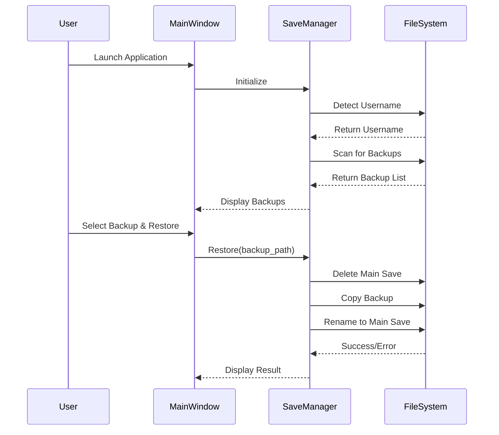

# Design Document: Scumgenics Save Manager

## Overview

Scumgenics is a PyQt6-based desktop application for managing Mewgenics game save files on Windows. The application provides a graphical interface for viewing, backing up, and restoring game saves through a simple file management system.

The core functionality revolves around three operations:
1. **Discovery**: Automatically detecting the Windows username and locating save files in the AppData directory
2. **Backup Management**: Listing and creating timestamped backup copies of save files
3. **Restoration**: Replacing the active save file with a selected backup through a delete-then-copy operation

The application is designed for distribution to the Mewgenics community on Reddit, requiring zero configuration and automatic adaptation to different Windows user accounts.

## Architecture

### System Architecture

The application follows a layered architecture pattern:

```
┌─────────────────────────────────────────┐
│         Presentation Layer              │
│         (PyQt6 Widgets)                 │
└─────────────────┬───────────────────────┘
                  │
┌─────────────────▼───────────────────────┐
│         Application Layer               │
│    (Save Manager Controller)            │
└─────────────────┬───────────────────────┘
                  │
┌─────────────────▼───────────────────────┐
│         Domain Layer                    │
│    (File Operations & Path Logic)       │
└─────────────────┬───────────────────────┘
                  │
┌─────────────────▼───────────────────────┐
│         Infrastructure Layer            │
│    (File System, OS Integration)        │
└─────────────────────────────────────────┘
```

### Component Interaction Flow



## Components and Interfaces

### 1. MainWindow (Presentation Layer)

**Responsibility**: Provides the graphical user interface for user interactions.

**Interface**:
```python
class MainWindow(QMainWindow):
    def __init__(self):
        """Initialize the main window with title 'Scumgenics'"""
        
    def display_backups(self, backups: List[BackupInfo]) -> None:
        """Display the list of available backups in the UI"""
        
    def display_error(self, message: str) -> None:
        """Show error message dialog to user"""
        
    def display_success(self, message: str) -> None:
        """Show success message dialog to user"""
        
    def on_restore_clicked(self) -> None:
        """Handle restore button click event"""
        
    def on_create_backup_clicked(self) -> None:
        """Handle create backup button click event"""
        
    def get_selected_backup(self) -> Optional[str]:
        """Return the currently selected backup filename"""
```

**UI Layout**:
- Window title: "Scumgenics"
- Backup list widget (QListWidget) showing available backups
- Restore button (enabled only when backup selected)
- Create Local Backup button
- Status label for displaying messages

### 2. SaveManager (Application Layer)

**Responsibility**: Orchestrates save file operations and business logic.

**Interface**:
```python
class SaveManager:
    def __init__(self):
        """Initialize save manager with path configuration"""
        
    def get_username(self) -> str:
        """Detect and return the current Windows username"""
        
    def get_main_save_path(self) -> Path:
        """Return the path to the main save file"""
        
    def get_backup_directory(self) -> Path:
        """Return the path to the backup directory"""
        
    def get_local_backup_directory(self) -> Path:
        """Return the path to the local backup directory"""
        
    def list_backups(self) -> List[BackupInfo]:
        """Scan and return list of available backups, sorted by timestamp descending"""
        
    def restore_backup(self, backup_filename: str) -> Result:
        """Restore a backup as the main save file"""
        
    def create_local_backup(self) -> Result:
        """Create a timestamped backup in the local directory"""
        
    def verify_main_save_exists(self) -> bool:
        """Check if the main save file exists"""
```

### 3. FileOperations (Domain Layer)

**Responsibility**: Handles low-level file system operations with error handling.

**Interface**:
```python
class FileOperations:
    @staticmethod
    def delete_file(path: Path) -> Result:
        """Delete a file, return success or error"""
        
    @staticmethod
    def copy_file(source: Path, destination: Path) -> Result:
        """Copy a file from source to destination"""
        
    @staticmethod
    def rename_file(old_path: Path, new_path: Path) -> Result:
        """Rename a file"""
        
    @staticmethod
    def list_files(directory: Path, pattern: str) -> List[Path]:
        """List files in directory matching pattern"""
        
    @staticmethod
    def ensure_directory_exists(path: Path) -> Result:
        """Create directory if it doesn't exist"""
        
    @staticmethod
    def file_exists(path: Path) -> bool:
        """Check if file exists"""
```

### 4. PathBuilder (Domain Layer)

**Responsibility**: Constructs file system paths based on username and conventions.

**Interface**:
```python
class PathBuilder:
    GAME_DIRECTORY_TEMPLATE = r"C:\Users\{username}\AppData\Roaming\Glaiel Games\Mewgenics\76561197960287930\saves"
    MAIN_SAVE_FILENAME = "steamcampaign01.sav"
    BACKUP_SUBDIRECTORY = "backups"
    BACKUP_FILENAME_PATTERN = r"steamcampaign01_\d{4}-\d{2}-\d{2}_\d{2}-\d{2}\.savbackup"
    
    @staticmethod
    def build_main_save_path(username: str) -> Path:
        """Build path to main save file"""
        
    @staticmethod
    def build_backup_directory_path(username: str) -> Path:
        """Build path to backup directory"""
        
    @staticmethod
    def build_backup_filename(timestamp: datetime) -> str:
        """Build backup filename with timestamp"""
        
    @staticmethod
    def parse_backup_timestamp(filename: str) -> Optional[datetime]:
        """Extract timestamp from backup filename"""
```

## Data Models

### BackupInfo

Represents information about a backup save file.

```python
@dataclass
class BackupInfo:
    filename: str           # e.g., "steamcampaign01_2024-01-15_14-30.savbackup"
    full_path: Path         # Complete file system path
    timestamp: datetime     # Parsed from filename
    size_bytes: int         # File size for display
    
    def display_name(self) -> str:
        """Return formatted display name for UI"""
        return f"{self.timestamp.strftime('%Y-%m-%d %H:%M')} ({self.size_bytes // 1024} KB)"
```

### Result

Represents the outcome of an operation with success/error information.

```python
@dataclass
class Result:
    success: bool
    message: str
    error_details: Optional[str] = None
    
    @staticmethod
    def ok(message: str) -> Result:
        """Create a successful result"""
        return Result(success=True, message=message)
    
    @staticmethod
    def error(message: str, details: str = None) -> Result:
        """Create an error result"""
        return Result(success=False, message=message, error_details=details)
```

### SaveManagerConfig

Configuration data for the save manager.

```python
@dataclass
class SaveManagerConfig:
    username: str
    main_save_path: Path
    backup_directory: Path
    local_backup_directory: Path
```


## Correctness Properties

*A property is a characteristic or behavior that should hold true across all valid executions of a system-essentially, a formal statement about what the system should do. Properties serve as the bridge between human-readable specifications and machine-verifiable correctness guarantees.*

### Property 1: Dynamic Path Construction

*For any* valid Windows username, the constructed main save path should follow the template `C:\Users\{username}\AppData\Roaming\Glaiel Games\Mewgenics\76561197960287930\saves\steamcampaign01.sav` and different usernames should produce different paths.

**Validates: Requirements 2.2, 2.3, 3.1**

### Property 2: Main Save Existence Verification

*For any* operation that requires the main save file, the system should verify the file exists before attempting the operation.

**Validates: Requirements 3.3**

### Property 3: Backup Pattern Filtering

*For any* directory contents, the backup scanning function should return only files matching the pattern `steamcampaign01_YYYY-MM-DD_HH-MM.savbackup` where YYYY-MM-DD represents a valid date and HH-MM represents valid time.

**Validates: Requirements 4.1**

### Property 4: Backup List Display Completeness

*For any* list of backup files returned by the scanner, all backup filenames should appear in the UI display.

**Validates: Requirements 4.2**

### Property 5: Backup Timestamp Sorting

*For any* list of backup files, the displayed list should be sorted by timestamp in descending order (newest first).

**Validates: Requirements 4.3**

### Property 6: Restore Button State Consistency

*For any* UI state, the restore button should be enabled if and only if a backup is currently selected.

**Validates: Requirements 5.2, 5.3**

### Property 7: Restore Operation Sequence

*For any* restore operation with a valid backup file, the system should execute the following sequence: (1) delete the existing main save file, (2) copy the backup file to the game directory, (3) rename the copied file to `steamcampaign01.sav`, and the final result should be a main save file with the same content as the selected backup.

**Validates: Requirements 6.1, 6.2, 6.3**

### Property 8: Operation Success Feedback

*For any* successful file operation (restore or backup creation), the system should display a success message to the user.

**Validates: Requirements 6.4, 7.5**

### Property 9: Operation Failure Feedback

*For any* failed file operation, the system should display an error message that includes the failure reason and the specific file path involved.

**Validates: Requirements 6.5, 7.6, 8.1, 8.2, 8.3, 8.4**

### Property 10: Local Backup Creation with Timestamp

*For any* local backup creation operation, the system should copy the main save file to the local backup directory with a filename matching the format `steamcampaign01_YYYY-MM-DD_HH-MM.savbackup` where the timestamp reflects the creation time.

**Validates: Requirements 7.2, 7.4**

### Property 11: Directory Creation on Demand

*For any* backup creation operation, if the local backup directory does not exist before the operation, it should exist after a successful operation.

**Validates: Requirements 7.3**

### Property 12: Cross-User Portability

*For any* two different Windows usernames, the application should successfully construct valid paths and operate correctly without requiring code modifications.

**Validates: Requirements 9.4**

## Error Handling

### Error Categories

The application handles four categories of errors:

1. **File Not Found Errors**
   - Main save file missing
   - Backup file missing during restore
   - Display: "File not found: {path}"

2. **Permission Errors**
   - Insufficient permissions to read/write files
   - Insufficient permissions to access directories
   - Display: "Access denied: {path}. Please check file permissions."

3. **I/O Errors**
   - Disk full during copy operations
   - File locked by another process
   - Corrupted file system
   - Display: "I/O error: {operation} failed for {path}. {details}"

4. **Path Construction Errors**
   - Unable to detect username
   - Invalid characters in paths
   - Display: "Configuration error: {details}"

### Error Handling Strategy

**Fail-Fast Principle**: Operations should validate preconditions before making changes. For restore operations, verify both the main save and backup file exist before deleting anything.

**Atomic Operations**: While the restore operation is inherently two-step (delete then copy), the application should:
- Verify the backup file is readable before deleting the main save
- If the copy operation fails after deletion, display a clear error indicating the main save was deleted but restoration failed
- Recommend the user manually copy the backup file

**Error Message Format**:
```
[Operation] failed: [Reason]
File: [Full Path]
[Additional Details]
```

**Logging**: All errors should be logged to a file in the application directory for debugging purposes, including:
- Timestamp
- Operation attempted
- File paths involved
- Exception details
- System information (username, OS version)

### Recovery Mechanisms

**Main Save Deletion Recovery**: If restore fails after deleting the main save, the application should:
1. Display error message with the backup file path
2. Provide instructions for manual restoration
3. Keep the backup file intact

**Backup Creation Failure**: If local backup creation fails:
1. Do not modify the main save file
2. Display error with specific reason
3. Suggest checking disk space and permissions

## Testing Strategy

### Dual Testing Approach

The application will use both unit testing and property-based testing to ensure comprehensive coverage:

- **Unit tests**: Verify specific examples, edge cases, and error conditions
- **Property tests**: Verify universal properties across all inputs using randomized testing

### Unit Testing

Unit tests will focus on:

1. **Specific Examples**
   - Window title is "Scumgenics" (Requirement 1.1)
   - Username detection returns non-empty string (Requirement 2.1)
   - Missing main save displays error (Requirement 3.2)
   - Empty backup directory shows "no backups" message (Requirement 4.4)
   - UI selection enables/disables restore button (Requirement 5.1)
   - Backup creation UI option exists (Requirement 7.1)

2. **Edge Cases**
   - Empty backup directory
   - Backup files with invalid timestamp formats
   - Very long usernames
   - Special characters in usernames
   - Disk full scenarios
   - File locked by another process

3. **Error Conditions**
   - File not found errors
   - Permission denied errors
   - I/O errors during copy operations
   - Invalid path construction

### Property-Based Testing

Property-based testing will use **Hypothesis** (Python property-based testing library) to verify universal properties with randomized inputs.

**Configuration**: Each property test will run a minimum of 100 iterations to ensure comprehensive input coverage.

**Test Tagging**: Each property test will include a comment referencing the design document property:
```python
# Feature: mewgenics-save-manager, Property 1: Dynamic Path Construction
```

**Properties to Test**:

1. **Property 1: Dynamic Path Construction**
   - Generate random valid Windows usernames
   - Verify paths follow template and vary with username
   - **Feature: mewgenics-save-manager, Property 1: Dynamic Path Construction**

2. **Property 2: Main Save Existence Verification**
   - Generate random operation requests
   - Verify existence check occurs before operations
   - **Feature: mewgenics-save-manager, Property 2: Main Save Existence Verification**

3. **Property 3: Backup Pattern Filtering**
   - Generate random directory contents with valid and invalid filenames
   - Verify only pattern-matching files are returned
   - **Feature: mewgenics-save-manager, Property 3: Backup Pattern Filtering**

4. **Property 4: Backup List Display Completeness**
   - Generate random backup file lists
   - Verify all filenames appear in UI
   - **Feature: mewgenics-save-manager, Property 4: Backup List Display Completeness**

5. **Property 5: Backup Timestamp Sorting**
   - Generate random lists of backup files with various timestamps
   - Verify descending timestamp order
   - **Feature: mewgenics-save-manager, Property 5: Backup Timestamp Sorting**

6. **Property 6: Restore Button State Consistency**
   - Generate random UI selection states
   - Verify button enabled state matches selection state
   - **Feature: mewgenics-save-manager, Property 6: Restore Button State Consistency**

7. **Property 7: Restore Operation Sequence**
   - Generate random backup files
   - Verify delete-copy-rename sequence and content preservation
   - **Feature: mewgenics-save-manager, Property 7: Restore Operation Sequence**

8. **Property 8: Operation Success Feedback**
   - Generate random successful operations
   - Verify success message displayed
   - **Feature: mewgenics-save-manager, Property 8: Operation Success Feedback**

9. **Property 9: Operation Failure Feedback**
   - Generate random failure scenarios
   - Verify error message includes reason and path
   - **Feature: mewgenics-save-manager, Property 9: Operation Failure Feedback**

10. **Property 10: Local Backup Creation with Timestamp**
    - Generate random backup creation requests
    - Verify filename format and timestamp accuracy
    - **Feature: mewgenics-save-manager, Property 10: Local Backup Creation with Timestamp**

11. **Property 11: Directory Creation on Demand**
    - Generate random backup operations with non-existent directories
    - Verify directory exists after successful operation
    - **Feature: mewgenics-save-manager, Property 11: Directory Creation on Demand**

12. **Property 12: Cross-User Portability**
    - Generate random pairs of Windows usernames
    - Verify application operates correctly for both
    - **Feature: mewgenics-save-manager, Property 12: Cross-User Portability**

### Test Environment

**Platform**: Windows 10/11 (primary target)

**Test Data**:
- Mock file system for unit tests (using `unittest.mock` or `pytest-mock`)
- Temporary directories for integration tests
- Sample save files with known content for restoration testing

**Continuous Integration**: Tests should run on every commit to ensure no regressions.

### Testing Tools

- **pytest**: Test framework
- **Hypothesis**: Property-based testing library
- **pytest-qt**: PyQt6 testing utilities
- **pytest-mock**: Mocking file system operations
- **coverage.py**: Code coverage measurement (target: >90%)
